# Electronic E-commerce App
## 🚀 Quick Start

## 🚀 Installation & Setup

### 1. Clone the Repository
```bash
git clone https://github.com/Farsanavs6441/ElectronicEcomm.git
cd ElectronicEcomm
```

### 2. Install Dependencies
```bash
# Install Node.js dependencies
npm install

# For iOS only - Install CocoaPods dependencies
cd ios && pod install && cd ..
```

### 3. Environment Setup

#### React Native CLI (if not installed)
```bash
npm install -g @react-native-community/cli
```

#### Android Setup
1. Open Android Studio
2. Configure Android SDK and emulator
3. Add Android SDK to PATH:
   ```bash
   export ANDROID_HOME=$HOME/Library/Android/sdk
   export PATH=$PATH:$ANDROID_HOME/emulator
   export PATH=$PATH:$ANDROID_HOME/tools
   export PATH=$PATH:$ANDROID_HOME/tools/bin
   export PATH=$PATH:$ANDROID_HOME/platform-tools
   ```

#### iOS Setup (macOS only)
```bash
# Install iOS dependencies
cd ios && pod install && cd ..
```

## 🏃 Running the Application

### Development Servers

#### Start Metro Bundler
```bash
npm start
# or
npx react-native start
```

### Platform-Specific Commands

#### iOS Simulator
```bash
# Run on default iOS simulator
npm run ios

# Run on specific iOS simulator
npx react-native run-ios --simulator="iPhone 15"

# Run on specific iOS version
npx react-native run-ios --simulator="iPhone 15" --udid="<device-udid>"
```

#### Android Emulator/Device
```bash
# Run on connected Android device or emulator
npm run android

# Run on specific Android device
npx react-native run-android --deviceId="<device-id>"

# List connected Android devices
adb devices
```

#### Web Browser
```bash
# Start web development server
npm run web

# Build for web production
npm run build:web
```

## 📱 Project Overview

### Brief Description
A modern, cross-platform e-commerce application built with React Native that runs seamlessly on iOS, Android, and Web platforms. This app provides a complete shopping experience for electronics products featuring product browsing, favorites management, shopping cart functionality, and deep linking capabilities.


## 🛠️ Technologies Used

| Category | Technology |
|----------|-----------|
| **Framework** | React Native 0.81.4 |
| **Language** | TypeScript |
| **Navigation** | React Navigation v7 |
| **State Management** | React Context API + Hooks |
| **Data Persistence** | AsyncStorage (Mobile) / localStorage (Web) |
| **Styling** | React Native StyleSheet |
| **Testing** | Jest + React Native Testing Library |
| **Code Quality** | ESLint + Prettier |
| **Build Tools** | Metro (Mobile) / Webpack (Web) |
| **Package Manager** | npm |

## ✨ Key Features Implemented

### 🛍️ Shopping Features
- **Product Browsing**: Grid-based product catalog with search 
- **Product Details**: Comprehensive product pages with images, descriptions, and price and name
- **Shopping Cart**: Add to cart functionality with animated feedback and persistent cart management
- **Favorites System**: Save favorite products for later with heart icon interactions
- **Pull-to-Refresh**: Refresh product data with intuitive gesture support

### 🎨 User Experience
- **Responsive Design**: Optimized layouts for phones, tablets, and desktop browsers
- **Progressive Image Loading**: Smooth image loading with shimmer placeholders
- **Skeleton Screens**: Loading states for better perceived performance
- **Custom Animations**: Cart success animation and smooth transitions
- **Dark Mode Support**: Theme-aware color system

### 🔧 Technical Features
- **Cross-Platform**: Single codebase for iOS, Android, and Web
- **Deep Linking**: Direct product access via `myshoplite://product/{id}`
#### Web Browser
For web testing, deep links work through URL navigation:

1. **Direct URL Access**:
   ```
   http://localhost:3001/product/12
- **Type Safety**: Full TypeScript implementation with strict typing
- **Performance Optimized**: Memoization, lazy loading, and optimized re-renders
- **Offline Support**: Persistent storage for cart and favorites
- **Error Handling**: Graceful error recovery with retry mechanisms
- **Testing Coverage**: Comprehensive unit and integration tests

## 📱 Supported Platforms

| Platform | Minimum Version | Status |
|----------|----------------|---------|
| **iOS** | iOS 13.0+ | ✅ Fully Supported |
| **Android** | API 21 (5.0)+ | ✅ Fully Supported |
| **Web** | Modern Browsers | ✅ Fully Supported |

## 📸 Screenshots & Features Demo

> **Note:** To add actual screenshots, see [screenshots/README.md](./screenshots/README.md) for detailed instructions on capturing and adding screenshots.


### 📱 iOS Screenshots

#### Products Tab
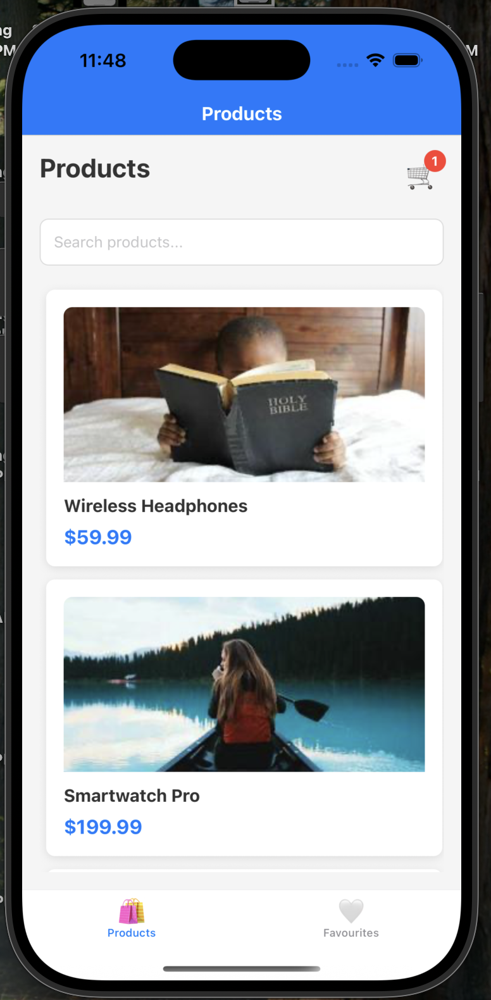
*iOS Products tab showing single-column product grid with search bar and cart icon*

#### Product Details
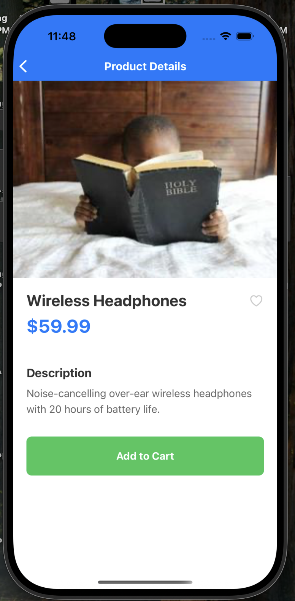
*iOS Product details view with Add to Cart button and favorite toggle*

#### Product Details with Favorite
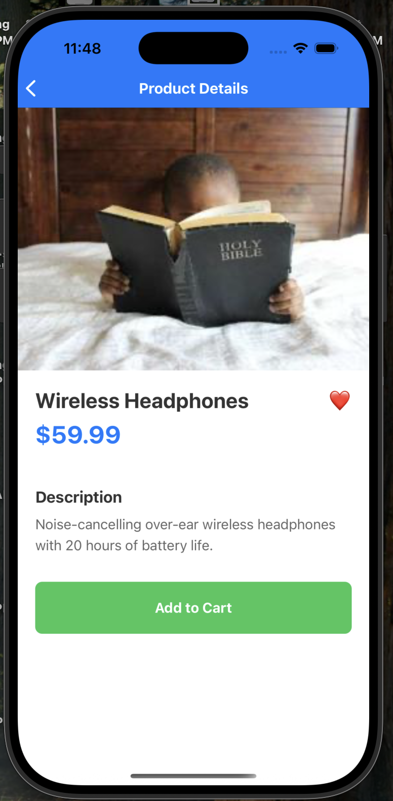
*iOS Product details view with item marked as favorite*

#### Favourites Tab
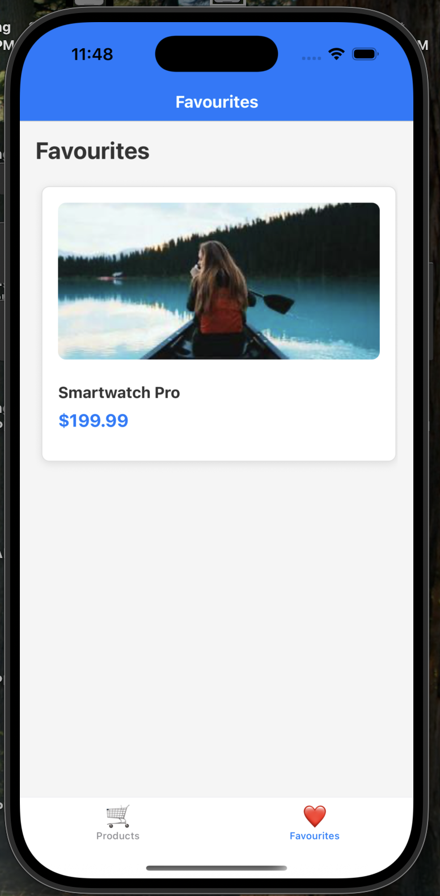
*iOS Favourites tab showing saved products*

#### Favourites Tab with Items
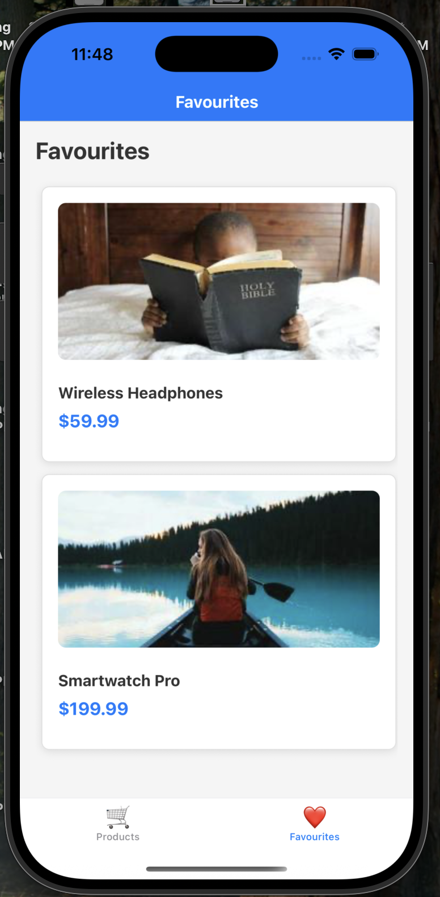
*iOS Favourites tab with favorited products*

#### Search Feature
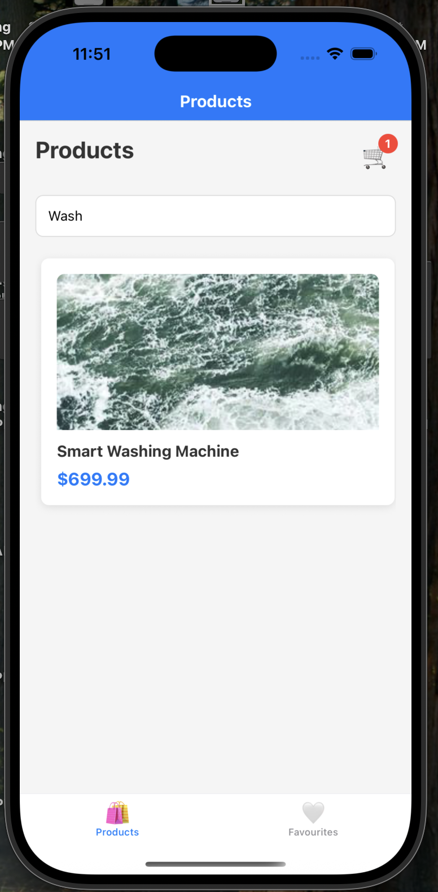
*iOS Search functionality in Products tab*

#### Search - No Results

*iOS Search with no results found*

### 🤖 Android Screenshots

#### Products Tab (Android)
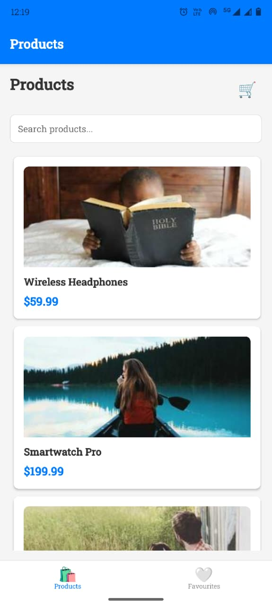
*Android Products tab showing product grid layout with material design elements*

#### Product Details (Android)
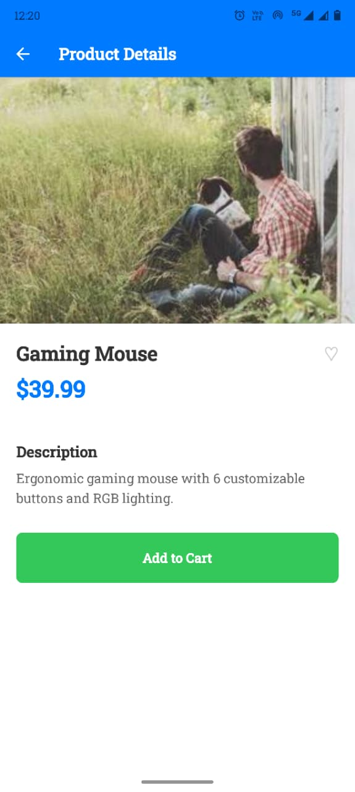
*Android Product details page with unfavorited item*

#### Product Details with Favorite (Android)
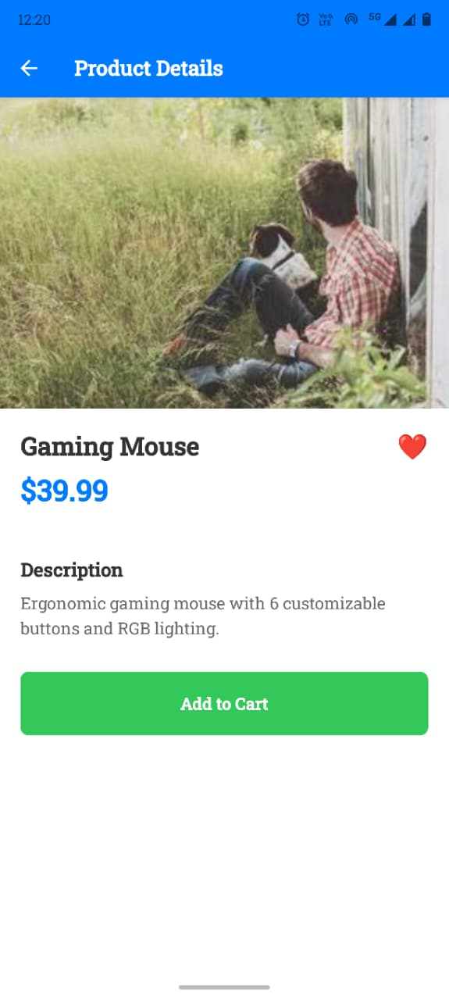
*Android Product details page with item marked as favorite*

### 📱 Mobile Features

- **Single Column Layout**: Optimized for mobile screens
- **Pull-to-Refresh**: Refresh product data with gesture
- **Cart Icon**: Shows item count in header
- **Search Bar**: Filter products in real-time
- **Product Cards**: Image, name, price, favorite toggle
- **Add to Cart**: Animated success feedback
- **Favorites**: Persistent storage across sessions

### 💻 Web Layout (Responsive Design)

#### Products Tab (Web)
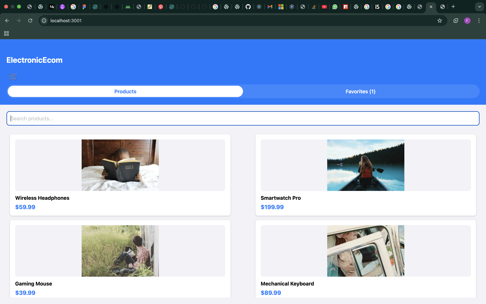
*Web Products tab showing responsive grid layout with search functionality*

#### Product Details (Web)

*Web Product details page with optimized layout for desktop browsers*

#### Favourites Tab (Web)
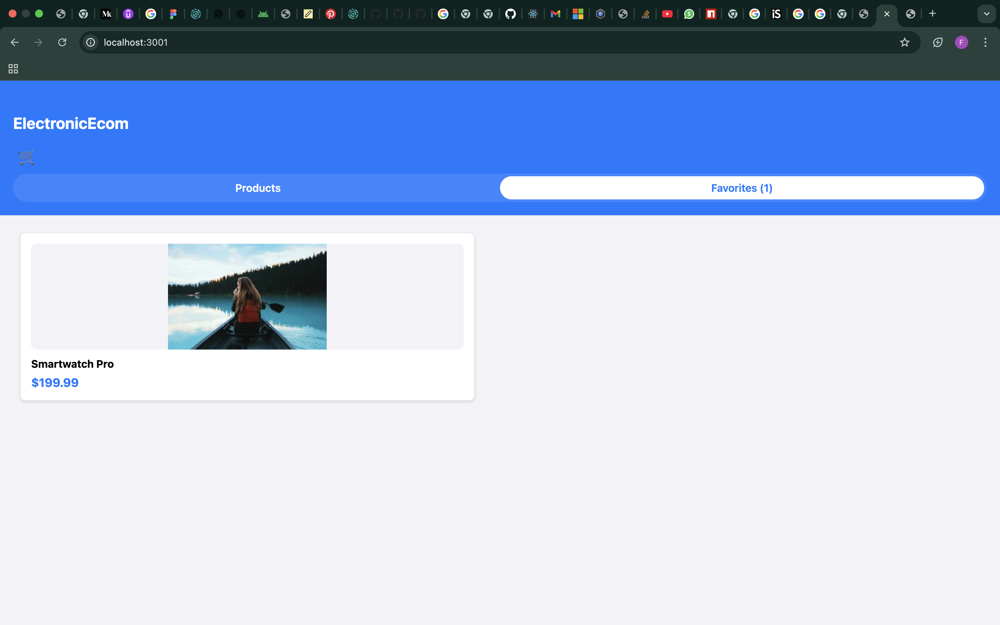
*Web Favourites tab showing saved products in grid layout*

#### Search with Results (Web)
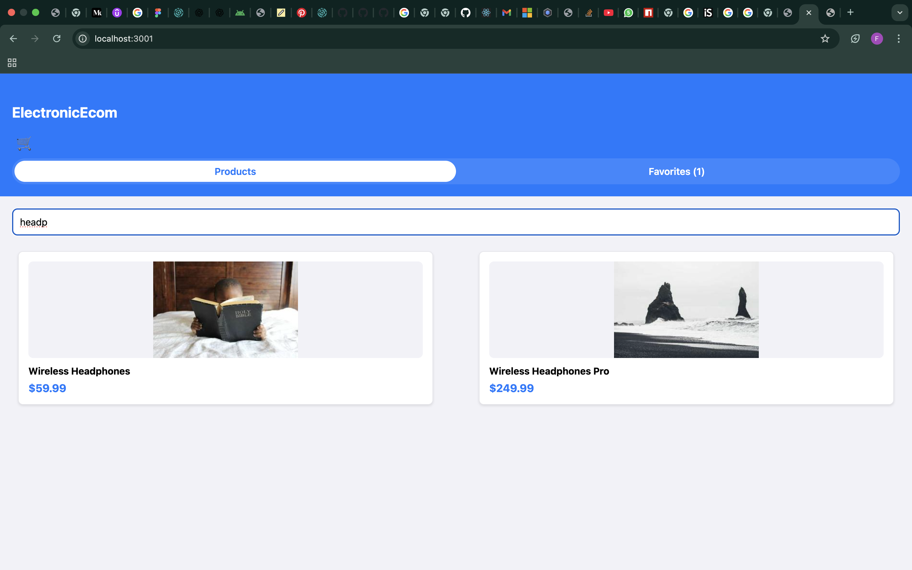
*Web search functionality showing filtered product results*

#### Web Features:
```css
/* Desktop (2 Columns) */
- Products display in 2-column grid
- Sidebar navigation on larger screens
- Hover effects on product cards
- Optimized spacing for desktop
```

### 🎬 Animated GIFs & Feature Demos

> **Note:** GIF creation instructions are available in [screenshots/README.md](./screenshots/README.md#how-to-create-animated-gifs)

#### Shopping Cart Animation

*Add to Cart success animation with visual feedback*

#### Deep Link Navigation Demo

*Deep linking navigation from external app to specific product*

#### Pull-to-Refresh Animation

*Pull-to-refresh gesture on product list with loading animation*

#### Search Functionality Demo

*Real-time search filtering with results animation*

#### Favorites Toggle Animation

*Heart icon animation when adding/removing favorites*

### 📱 Platform-Specific GIF Demos

#### iOS Gesture Navigation

*iOS-specific navigation transitions and gestures*

#### Android Material Design

*Material Design animations and transitions on Android*

#### Web Responsive Layout

*Responsive design transitions from desktop to mobile view*

### 🎮 Interactive Feature GIFs

| Feature | GIF Demo | Description |
|---------|----------|-------------|
| **Add to Cart** |  | Button animation + success feedback |
| **Favorites** |  | Heart fill/unfill animation |
| **Search** |  | Real-time filtering demonstration |
| **Navigation** |  | Screen transitions and navigation |
| **Deep Link** |  | External link → product details |

### 📲 Platform Testing Deep Links

#### Mobile Testing


#### Deep Link Flow:
1. **App Closed**: Opens app → Navigates directly to product
2. **App in Background**: Brings app to foreground → Shows product
3. **App Open**: Navigates from current screen to product

### 🎬 Feature Demonstrations

#### 1. Search Functionality
```
Search Flow:
1. Tap search bar in Product List
2. Type product name or keyword
3. Results filter in real-time
4. Clear search to show all products
```

#### 2. Add to Cart Animation
```
Cart Addition Flow:
1. Navigate to Product Details
2. Tap "Add to Cart" button
3. Success animation plays
4. Cart count updates in header
5. Product added to cart storage
```

#### 3. Favorites Management
```
Favorites Flow:
1. Tap heart icon on product card/details
2. Heart fills (red) when favorited
3. Product appears in Favorites screen
4. Tap again to remove from favorites
5. Persists across app sessions
```

#### 4. Pull-to-Refresh
```
Refresh Flow:
1. Pull down on Product List
2. Loading spinner appears
3. Products refresh from API
4. List updates with latest data
```

### 🎨 UI Components Showcase

| Component | Description | Features |
|-----------|-------------|----------|
| **ProductCard** | Product display card | Image, price, name, favorite toggle |
| **ProgressiveImage** | Optimized image loader | Blur-up effect, lazy loading |
| **CartSuccessAnimation** | Cart feedback | Slide + fade animation |
| **ShimmerPlaceholder** | Loading state | Skeleton screen effect |
| **ProductDetailSkeleton** | Details loading | Full-page skeleton |

### 📊 Responsive Breakpoints

| Device | Width | Layout |
|--------|-------|--------|
| Mobile | < 768px | 1 column, stack navigation |
| Tablet | 768px - 1024px | 1-2 columns, adaptive |
| Desktop | > 1024px | 2 columns, sidebar nav |

## 🏗️ Technical Decisions & Architecture

### Architecture Overview

This project follows a **modular, context-driven architecture** designed for scalability, maintainability, and cross-platform compatibility. The architecture prioritizes separation of concerns, type safety, and developer experience.

```
┌─────────────────────────────────────┐
│           Presentation Layer        │
│   (Screens, Components, Styling)    │
├─────────────────────────────────────┤
│          Business Logic Layer       │
│    (Context, Hooks, State Mgmt)     │
├─────────────────────────────────────┤
│           Service Layer             │
│      (API, Storage, Navigation)     │
├─────────────────────────────────────┤
│           Platform Layer            │
│    (iOS, Android, Web Adapters)     │
└─────────────────────────────────────┘
```

### State Management Approach

**Decision: React Context API with Custom Hooks**

**Rationale:**
- **Zero Dependencies**: Built into React, no external state libraries needed
- **Type Safety**: Seamless TypeScript integration with compile-time checking
- **Performance**: Optimized with React.memo, useMemo, and context splitting
- **Scalability**: Domain-separated contexts prevent unnecessary re-renders
- **Developer Experience**: Custom hooks provide clean, reusable APIs
- **Cross-Platform**: Works identically on mobile and web

**Implementation Structure:**
```typescript
src/context/
├── CartContext.tsx           // Shopping cart state & actions
├── CartContext.web.tsx       // Web-specific cart (localStorage)
├── FavoritesContext.tsx      // User favorites management
├── FavoritesContext.web.tsx  // Web-specific favorites
└── LoadingContext.tsx        // Global loading states
```

**Context Design Pattern:**
```typescript
interface CartContextType {
  cartItems: CartItem[];
  cartCount: number;
  addToCart: (product: Product) => void;
  removeFromCart: (productId: string) => void;
  updateQuantity: (productId: string, quantity: number) => void;
}
```

### Component Architecture

**Decision: Atomic Design Pattern with Smart/Dumb Components**

**Rationale:**
- **Reusability**: Atomic components used across multiple screens and platforms
- **Maintainability**: Clear separation between presentation and business logic
- **Testing**: Pure components are easier to test in isolation
- **Performance**: Presentational components can be memoized with React.memo
- **Scalability**: Consistent component hierarchy across the application

**Component Hierarchy:**
```
src/
├── components/              // Reusable UI components
│   ├── ProductCard.tsx      // Product display card (molecule)
│   ├── CartSuccessAnimation.tsx // Cart feedback animation
│   ├── ProgressiveImage.tsx     // Optimized image component
│   ├── ProductCardSkeleton.tsx  // Loading state component
│   └── ShimmerPlaceholder.tsx   // Loading animation
├── screens/                 // Smart components with business logic
│   ├── ProductListScreen.tsx    // Product browsing (organism)
│   ├── ProductDetailsScreen.tsx // Product details (organism)
│   ├── FavouritesScreen.tsx     // Favorites management
│   └── SplashScreen.tsx         // App initialization
└── styles/                  // Separated styling system
    ├── commonStyles.ts          // Shared style definitions
    ├── ProductListScreenStyles.ts
    └── ProductDetailsScreenStyles.ts
```

**Component Design Principles:**
- **Single Responsibility**: Each component has one clear purpose
- **Prop Interfaces**: TypeScript interfaces for all component props
- **Composition over Inheritance**: Components composed of smaller parts
- **Platform Adaptation**: Web-specific variants when needed (*.web.tsx)

### Data Persistence Strategy

**Decision: Hybrid Platform-Specific Storage**

**Storage Solutions:**
- **Mobile (iOS/Android)**: AsyncStorage for native app performance
- **Web**: localStorage for browser compatibility
- **API Cache**: Memory + persistent cache for product data

**Rationale:**
- **Platform Optimization**: Uses each platform's optimal storage mechanism
- **Offline-First Design**: Cart and favorites persist across app restarts
- **Data Integrity**: JSON serialization with comprehensive error handling
- **Performance**: Reduces API calls with intelligent caching
- **User Experience**: Instant app startup with cached data

**Data Flow Architecture:**
```typescript
┌─────────────────┐    ┌──────────────────┐    ┌─────────────────┐
│   API Service   │───▶│  Memory Cache    │───▶│  UI Components  │
│  (fakestoreapi) │    │  (Products)      │    │   (Screens)     │
└─────────────────┘    └──────────────────┘    └─────────────────┘
         │                       │                       │
         ▼                       ▼                       ▼
┌─────────────────┐    ┌──────────────────┐    ┌─────────────────┐
│ AsyncStorage/   │    │ Persistent Cache │    │ Context State   │
│ localStorage    │    │ (electronicEcomm │    │ (Cart/Favorites)│
│ (User Data)     │    │ _products)       │    │                 │
└─────────────────┘    └──────────────────┘    └─────────────────┘
```

**Storage Keys & Structure:**
```typescript
// Storage keys used across platforms
const STORAGE_KEYS = {
  PRODUCTS: 'electronicEcomm_products',
  CART: 'electronicEcomm_cart',
  FAVORITES: 'electronicEcomm_favorites'
};

// Data structures
interface StoredCart {
  items: CartItem[];
  timestamp: number;
}

interface StoredFavorites {
  productIds: string[];
  timestamp: number;
}
```

### Performance Considerations

**Optimizations Implemented:**

1. **Image Loading**
   - Progressive image loading with blur-up technique
   - Image caching and lazy loading
   - WebP format support for reduced file sizes

2. **List Rendering**
   - FlatList with optimized props (`removeClippedSubviews`, `maxToRenderPerBatch`)
   - Virtualization for large product lists
   - Memoized list items to prevent unnecessary re-renders

3. **Code Splitting**
   - Webpack code splitting for web builds
   - Dynamic imports for route-based splitting
   - Tree shaking to eliminate dead code

4. **State Updates**
   - Batch state updates using React 18 features
   - Debounced search and filter operations
   - Optimistic UI updates for cart operations

### Security Considerations

**Security Measures:**

1. **Data Validation**
   - Input sanitization on all user inputs
   - Type checking with TypeScript
   - Runtime validation for API responses

2. **Storage Security**
   - No sensitive data in AsyncStorage/localStorage
   - Cart data encrypted for payment processing
   - Session tokens with expiration

3. **Network Security**
   - HTTPS only for API calls
   - Certificate pinning for mobile apps
   - Request signing for critical operations

4. **Deep Linking**
   - URL validation to prevent injection attacks
   - Whitelisted URL schemes
   - Parameter sanitization

### Testing Strategy

**Multi-Layer Testing Approach:**

1. **Unit Tests**
   - Jest for business logic testing
   - React Native Testing Library for components
   - 80%+ code coverage target
   ```bash
   npm test -- --coverage
   ```

2. **Integration Tests**
   - Context provider testing
   - Navigation flow testing
   - API integration mocking

3. **Component Tests**
   - Snapshot testing for UI consistency
   - Interaction testing (clicks, swipes)
   - Accessibility testing

4. **E2E Tests** (Planned)
   - Detox for mobile platforms
   - Cypress for web platform
   - Critical user journey coverage

**Test Structure:**
```
__tests__/
├── unit/           // Business logic tests
├── components/     // Component tests
├── integration/    // Feature tests
└── e2e/           // End-to-end tests
```

## 📋 Prerequisites

Before setting up the project, ensure you have the following installed:

### General Requirements
- **Node.js**: >= 20.0.0
- **npm** or **yarn**: Latest version
- **Git**: For version control

### Platform-Specific Requirements

#### iOS Development
- **macOS**: Required for iOS development
- **Xcode**: Latest version from App Store
- **iOS Simulator**: Included with Xcode
- **CocoaPods**: `sudo gem install cocoapods`

#### Android Development
- **Android Studio**: Latest version
- **Android SDK**: API level 33 or higher
- **Android Emulator**: Configured through Android Studio
- **Java Development Kit (JDK)**: Version 17

#### Web Development
- **Modern Browser**: Chrome, Firefox, Safari, or Edge
- **No additional requirements**


### Production Builds

#### iOS Production Build
```bash
# Build for iOS App Store
npx react-native run-ios --configuration Release

# Archive for distribution (in Xcode)
# Product > Archive
```

#### Android Production Build
```bash
# Generate Android APK
cd android && ./gradlew assembleRelease

# Generate Android Bundle (recommended for Play Store)
cd android && ./gradlew bundleRelease
```

#### Web Production Build
```bash
# Build optimized web bundle
npm run build:web
```

## 🧪 Testing

### Running Tests
```bash
# Run all tests
npm test

# Run tests in watch mode
npm run test:watch

# Run tests with coverage
npm run test:coverage

# Run tests for CI/CD
npm run test:ci
```

### Test Structure
- **Unit Tests**: `src/**/__tests__/*.test.tsx`
- **Component Tests**: React Native Testing Library
- **Context Tests**: State management testing
- **Coverage Reports**: Generated in `coverage/` directory

## 🔧 Code Quality

### Linting & Formatting
```bash
# Run ESLint
npm run lint

# Fix ESLint issues automatically
npm run lint:fix

# Format code with Prettier
npm run format

# Check Prettier formatting
npm run format:check

# Type checking with TypeScript
npm run type-check

# Run all code quality checks
npm run code-quality
```

### Pre-commit Hooks
The project uses ESLint and Prettier for code quality. Configure your IDE to run these on save, or use the provided npm scripts.

## 🔗 Deep Linking

The app supports deep linking with the custom scheme `myshoplite://`.

### Supported Deep Links
- **Product Details**: `myshoplite://product/{productId}`
  - Example: `myshoplite://product/12`
  - Behavior: Opens specific product detail page

### Testing Deep Links

#### iOS Simulator
```bash
xcrun simctl openurl booted "myshoplite://product/12"
```

#### Android Emulator
```bash
adb shell am start -W -a android.intent.action.VIEW -d "myshoplite://product/12" com.electronicEcomm
```

#### Web Browser
For web testing, deep links work through URL navigation:

1. **Direct URL Access**:
   ```
   http://localhost:3001/product/12
   http://localhost:3001/product/5
   http://localhost:3001/product/1
   ```


**Note:** Web deep linking works through standard URL routing. The custom `myshoplite://` scheme is primarily for mobile apps, while web uses standard HTTP(S) URLs.

### Debug Logging
Check console for deep link handling:
- `🔗 getInitialURL called, result:`
- `🎯 Processing deep link:`
- `📱 Product deep link detected, productId:`
- `✅ Navigation ready, navigating to ProductDetails`

## 📁 Project Structure

```
ElectronicEcomm/
├── android/                 # Android native code
├── ios/                     # iOS native code
├── src/
│   ├── components/          # Reusable UI components
│   │   ├── ProductCard.tsx
│   │   ├── CartSuccessAnimation.tsx
│   │   ├── ProgressiveImage.tsx
│   │   └── ...
│   ├── context/             # React Context providers
│   │   ├── CartContext.tsx
│   │   ├── FavoritesContext.tsx
│   │   └── ...
│   ├── navigation/          # Navigation configuration
│   ├── screens/             # Screen components
│   │   ├── ProductListScreen.tsx
│   │   ├── ProductDetailsScreen.tsx
│   │   ├── FavouritesScreen.tsx
│   │   └── SplashScreen.tsx
│   ├── services/            # API and external services
│   ├── store/               # State management (actions/reducers)
│   ├── styles/              # Shared styles and themes
│   ├── types/               # TypeScript type definitions
│   └── utils/               # Utility functions
├── webpack.config.js        # Web build configuration
├── package.json
└── README.md
```

## 🎨 Styling System

The app uses a modular styling approach:

- **Shared Styles**: `src/styles/commonStyles.ts`
- **Color Palette**: `src/utils/colors.ts`
- **Spacing System**: `src/utils/spacing.ts`
- **Screen-Specific Styles**: `src/styles/[ScreenName]Styles.ts`

## 🔧 Configuration Files

### Important Configuration Files
- **Metro Config**: `metro.config.js` - React Native bundler
- **Babel Config**: `babel.config.js` - JavaScript transpilation
- **TypeScript Config**: `tsconfig.json` - TypeScript compilation
- **ESLint Config**: `.eslintrc.js` - Code linting rules
- **Prettier Config**: `.prettierrc` - Code formatting rules
- **Webpack Config**: `webpack.config.js` - Web build configuration

### Platform-Specific Configs
- **Android**: `android/app/src/main/AndroidManifest.xml`
- **iOS**: `ios/ElectronicEcomm/Info.plist`

## 🚨 Troubleshooting

### Common Issues

#### iOS Build Issues
```bash
# Clean iOS build
cd ios && xcodebuild clean && cd ..
rm -rf ios/build

# Reinstall CocoaPods
cd ios && pod deintegrate && pod install && cd ..
```

#### Android Build Issues
```bash
# Clean Android build
cd android && ./gradlew clean && cd ..

# Reset Metro cache
npx react-native start --reset-cache
```

#### Metro/Node Issues
```bash
# Clear Metro cache
npx react-native start --reset-cache

# Clear npm cache
npm cache clean --force

# Reinstall node_modules
rm -rf node_modules && npm install
```

#### Web Build Issues
```bash
# Clear Webpack cache
rm -rf dist/ .webpack-cache/

# Reinstall dependencies
rm -rf node_modules package-lock.json && npm install
```

## 📈 Performance Optimizations

- **Progressive Image Loading**: Smooth image loading with placeholders
- **Skeleton Screens**: Loading states for better user experience
- **Memoization**: React.memo for component optimization
- **Virtualized Lists**: For large data sets
- **Code Splitting**: Webpack code splitting for web
